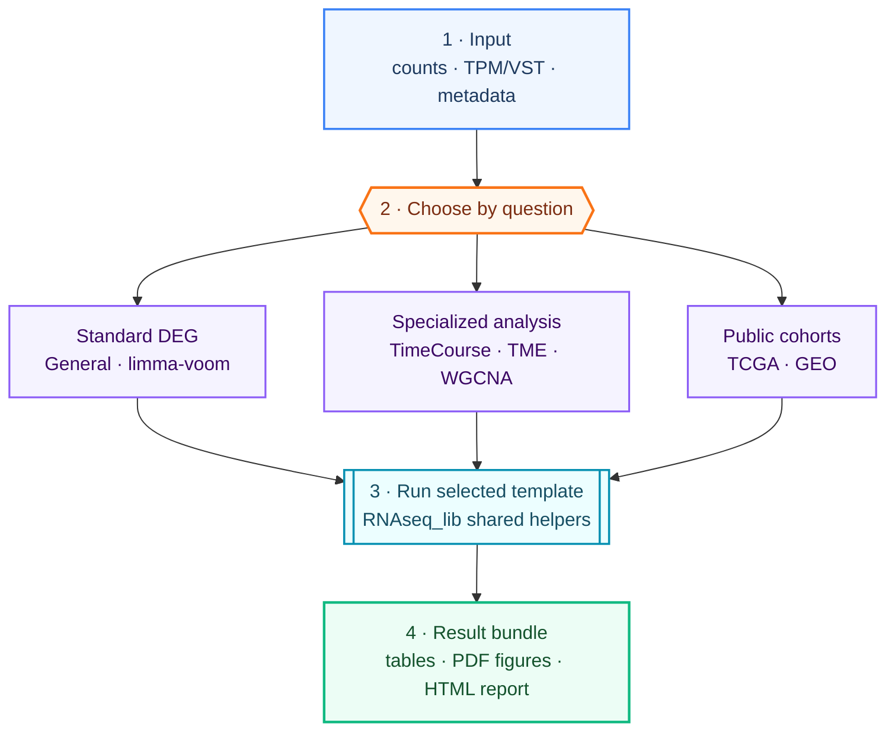

# RNAseq-Templates


Notebook-first bulk RNA-seq **downstream** analysis templates, backed by a lightweight shared R helper library (`RNAseq_lib/`).

Start from a count or TPM matrix and get reproducible, publication-oriented
results. In real projects, let `bulk-rnaseq-analysis` inspect the data and
research design, select the workflow, then adapt a project configuration. Use
the command-line runner for routine production runs and notebooks for focused
interactive exploration. Reusable validation, DEG thresholding, enrichment,
and plotting code stays in `RNAseq_lib/`.

> **Scope:** downstream analysis from expression matrices. Upstream steps (FASTQ QC, alignment, quantification, MultiQC) are out of scope.

## 🔄 How it works



Templates support **human or mouse where biologically applicable** (TCGA cohorts are human), are exercised by a CI smoke test on each push, and ship with runnable bundled-data demos under `examples/`. The required smoke path is offline and deterministic; optional KEGG services and IOBR integration still require network access or a populated local cache.

## 🤖 Codex / Claude Code Skill

The reusable
[`bulk-rnaseq-analysis`](https://github.com/yelu61/agent-ready-research-skills/tree/main/skills/bulk-rnaseq-analysis)
Skill is maintained in the public
[`agent-ready-research-skills`](https://github.com/yelu61/agent-ready-research-skills)
collection. It acts as the single agent entry point for bulk RNA-seq
downstream analysis, inspects the data source and requested analysis, and
routes work to:

- **RNAseq-Templates** for generic local/GEO matrix workflows.
- **[TCGA](https://github.com/yelu61/TCGA)** for TCGA/TARGET/GTEx,
  pan-cancer, mutation, multi-omics, prognostic, and external-validation tasks.

Invoke it in Codex or Claude Code:

```text
Use $bulk-rnaseq-analysis to inspect these counts and metadata,
choose the correct workflow, and run a reproducible DEG + enrichment analysis.
```

Install or link the Skill from its canonical collection directory. The Skill
bridges this repository and TCGA through explicit backend contracts; it does
not copy or merge either analysis implementation.

## 🧭 Which template should I use?

| I want to... | Use this template | Input | Key outputs |
| --- | --- | --- | --- |
| Standard DE across 2+ groups | `RNAseq_General.ipynb` | raw counts | multi-threshold DEG, ORA/GSEA/GSVA, QC, HTML report |
| Prefer limma-voom / batch covariate | `RNAseq_limma_voom_Template.ipynb` | raw counts | voom DEG, volcano, GO ORA |
| Analyze a time series / repeated measures | `RNAseq_TimeCourse_Template.ipynb` | VST matrix (from General) | Mfuzz clusters, time-point DEG |
| Quantify immune / stromal infiltration | `RNAseq_TME_Deconvolution_Template.ipynb` | counts + gene lengths (TPM internal) | IOBR/ESTIMATE/ssGSEA scores, heatmaps |
| Find co-expression modules | `RNAseq_WGCNA_Template.ipynb` | VST matrix (from General) | modules, module-trait cor, hub genes |
| Mine TCGA / GEO public data | `RNAseq_TCGA_GEO_Template.ipynb` | TCGA/GEO download or local matrix | Tumor-vs-Normal DEG, KM/Cox survival |

See [references/TEMPLATE_SELECTION.md](references/TEMPLATE_SELECTION.md) for a decision flow and workflow combinations. When in doubt, **start with `RNAseq_General.ipynb`** — it covers the most common case and exports the `vsd_matrix.csv` / `colData.csv` that the WGCNA and TimeCourse templates consume.

> ⚠️ **Input contract:** TME deconvolution requires TPM (computed internally from raw counts + gene lengths). It **rejects VST/rlog**, which cannot be inverted to TPM.

## Quick Start (No Programming Experience Needed)

1. Install **R** and **RStudio** ([instructions in GETTING_STARTED.md](GETTING_STARTED.md)).
2. Install all analysis dependencies:
   ```r
   Rscript install_dependencies.R
   ```
3. Validate the installation with the smoke test:
   ```r
   Rscript examples/run_demo_smoke_test.R
   ```
   The smoke test runs all six template demos on bundled or regenerated demo data and checks that all core outputs are produced (the same command the CI runs on every push). Enrichment results are data-dependent, so the assertions focus on the presence of the ORA summary rather than any single threshold-specific CSV.
4. Open the pre-configured demo notebook:
   ```
   examples/demo_RNAseq_General/RNAseq_General.ipynb
   ```
5. Click **Cell → Run All** and wait 2–5 minutes.
6. Check the generated `1-DEG/`, `2-GSEA/`, and `3-Visualization/` folders.

For a step-by-step guide, see [GETTING_STARTED.md](GETTING_STARTED.md).

<details>
<summary>📁 Repository layout</summary>

```text
notebooks/
  RNAseq_General.ipynb                  # standard DESeq2 DE (start here)
  RNAseq_limma_voom_Template.ipynb      # limma-voom alternative
  RNAseq_TimeCourse_Template.ipynb      # Mfuzz time-series clustering
  RNAseq_TME_Deconvolution_Template.ipynb  # immune/stromal deconvolution
  RNAseq_WGCNA_Template.ipynb           # co-expression network
  RNAseq_TCGA_GEO_Template.ipynb        # TCGA/GEO mining + survival
RNAseq_lib/                # shared R helpers (15 modules)
  io_utils.R  deg_utils.R  enrichment_utils.R  plot_utils.R
  tme_utils.R  tcga_utils.R  limma_voom_utils.R  timecourse_utils.R
  survival_utils.R  batch_utils.R  design_utils.R  geo_utils.R
  data_utils.R  report_utils.R
templates/                 # one CLI runner trio per template
  General/  Limma_Voom/  WGCNA/  TME/  TimeCourse/  TCGA_GEO/
    config.R                 #   edit per-project parameters
    run_analysis.R           #   Rscript entry point (same as notebook)
    visualize_results.R      #   re-plot from saved results (no recompute)
tools/notebook_to_runner.R   # notebook param cell -> config.R + runner draft
reports/analysis_report.qmd  # unified HTML report template
examples/
  run_demo_smoke_test.R    # runs every demo and validates outputs
  demo_data/               # shared demo counts + metadata
  demo_RNAseq_*/           # one bundled-data demo per template
references/                # parameters, function catalogue, template selection,
                           # report/visual/output-layout contracts and troubleshooting
GETTING_STARTED.md         # zero-programming-experience guide (Chinese)
ROADMAP.md  CHANGELOG.md  install_dependencies.R
```

All six `demo_RNAseq_*` demos are exercised by the CI smoke test on every push.

</details>

## Recommended Usage

### Option A — command line (reproducible / batch)

For running a pipeline without opening a notebook (scheduling, batch across
many projects, headless servers), use the script runner. **Every template —
General and all five topic templates — ships a `config.R` + `run_analysis.R` +
`visualize_results.R` trio under `templates/`.**

```bash
cp templates/General/{config.R,run_analysis.R,visualize_results.R} /path/to/project/
# edit /path/to/project/config.R, then:
cd /path/to/project && Rscript run_analysis.R
```

Swap `General` for `Limma_Voom`, `WGCNA`, `TME`, `TimeCourse`, or `TCGA_GEO` to
run that pipeline instead; each `run_analysis.R` shares the same bootstrap,
numbered `0-Config/1-DEG/...` output layout, and config snapshot. It runs the
same pipeline as the corresponding notebook and writes the same outputs.

The runner preserves the invocation directory, which is the path base for
relative input paths and `OUTDIR`; a relative config argument is resolved before
loading. In production, enter a fresh `analysis/runs/<run_id>/` before invoking
the central runner, so no output is written into the template source tree.

`run_analysis.R` also supports optional TME deconvolution (`RUN_TME`, output to
`4-TME/`) and caches `gseaResult` objects to `2-GSEA/gsea_results.rds`. After a
run, `Rscript visualize_results.R` regenerates targeted figures (key genes,
single-term gseaplot2, ORA theme dot-heatmaps) from the saved results without
recompute. See [templates/General/README.md](templates/General/README.md) for
batch execution and library-path resolution.

To convert a notebook's parameter cell into a `config.R` + `run_analysis.R`
draft for a new pipeline, use the converter:

```bash
Rscript tools/notebook_to_runner.R notebooks/RNAseq_General.ipynb out_dir --topic General
```

It extracts the `## 1. Parameter Configuration` cell into `config.R`, flattens
the remaining code cells into a runner draft, and writes a
`conversion_report.txt` flagging patterns that need manual refinement.

For a real project, run inside a versioned native output root such as
`analysis/runs/20260813_01/`, then curate reviewed deliverables into
`results/tables`, `results/figures`, and `results/reports`. See
[Real-project Output Layout](references/PROJECT_OUTPUT_LAYOUT.md).

### Option B — notebook (interactive exploration)

1. Copy a notebook from `notebooks/` into a concrete project folder only when
   interactive exploration is needed.
2. Keep access to `RNAseq_lib/` by either:
   - copying the `RNAseq_lib/` directory next to the project notebook, or
   - adjusting `LIB_DIR` in the notebook to point back to this repository.
3. Edit only the parameter cell first: species, input paths, sample names, groups, comparisons, thresholds, and optional gene sets.
4. Run all cells in order.

Before running, set and print an explicit output root. Do not execute with
`notebooks/` as the working/output directory: relative paths such as `1-DEG/`
otherwise create hundreds of native outputs beside the notebook.

The general notebook writes analysis outputs to:

```text
1-DEG/
2-GSEA/
3-Visualization/
Analysis_summary.txt
sessionInfo.txt
```

All major visualizations are saved as editable PDF files under `3-Visualization/`.
Selected manuscript-facing plots can additionally be exported as SVG/TIFF with
`save_plot_bundle()`. Final-size typography, label placement, and QA rules are
defined in [Publication Figure Standard](references/VISUALIZATION_STYLE_GUIDE.md).
Threshold-specific ORA figures are written to `3-Visualization/<threshold>/`.
GSEA outputs have explicit roles:

```text
3-Visualization/GSEA/overview/        dotplot, NES and ridge summaries
3-Visualization/GSEA/theme_maps/      theme-level exploratory maps
3-Visualization/GSEA/running_curves/  one explicitly selected term per PDF
3-Visualization/SingleGene/           one sample-level expression plot per selected gene
```

`RNAseq_General.ipynb` also exports reusable intermediate files for analyses that require variance-stabilized expression:

```text
1-DEG/vsd_matrix.csv
1-DEG/colData.csv
```

WGCNA and time-course clustering can use the exported VST matrix. TME deconvolution does **not** use VST as TPM: it defaults to the original raw counts plus gene lengths and computes TPM internally. VST/rlog cannot be inverted to TPM.

## General Bulk RNA-seq Workflow

`RNAseq_General.ipynb` includes:

- raw count loading and validation
- protein-coding filtering when annotation is available
- duplicate gene symbol handling
- low-count filtering based on the smallest group size
- DESeq2 differential expression with `lfcShrink(type = "ashr")`
- full all-gene DESeq2 result tables preserving raw and shrunken log2FC
- multi-threshold DEG outputs with `THRESHOLD_GRID`
- PCA and sample distance QC
- optional batch-effect PCA diagnostics and variance-explained summary
- optional paired/repeated-measures design support
- volcano plots and annotated DEG heatmaps
- key-gene and custom gene-set heatmaps
- GO/KEGG ORA with expressed-gene background, including dotplot, barplot, UP/DOWN bidirectional barplot, and optional cnetplot/emapplot
- GSEA GO/KEGG from full ranked gene lists, including dotplot, journal-style
  NES barplot, ridgeplot, and explicitly selected single-term running curves
- GSVA for custom gene sets with heatmap, combined boxplot, and per-signature violin/box/jitter PDFs
- single-gene expression plots with mean bar, SEM, sample points, and layered pairwise P values
- optional DoRothEA/VIPER TF activity analysis
- optional TME deconvolution (ESTIMATE / IOBR / ssGSEA; `RUN_TME` switch, output to `4-TME/`)
- DEG set overlap visualization (UpSet plot + Jaccard heatmap) across comparisons and thresholds
- optional multi-threshold DEG Excel export (`1-DEG/DEG_results.xlsx`)
- optional unified HTML report (`RNAseq_report.html`) summarizing DEG/ORA/GSEA/QC outputs

## Unified HTML report

Set `GENERATE_HTML_REPORT <- TRUE` in the General notebook (default) to render a single self-contained `RNAseq_report.html` from the saved CSV and PDF outputs — easier to share with collaborators than a folder of PDFs. The report is assembled by `reports/analysis_report.qmd` via `render_analysis_report()` and does not re-run any analysis. The default `.qmd` uses the [Quarto](https://quarto.org) CLI when available; without Quarto it automatically falls back to `rmarkdown` rendering the bundled `.Rmd` twin (`reports/analysis_report.Rmd`), so the report works out of the box. The report cell skips gracefully with an actionable message only when neither renderer is installed.

The report follows a machine-checkable [RNA-seq HTML Report Contract](references/REPORT_CONTRACT.md): every analysis domain is marked as covered, not applicable, intentionally omitted, or unresolved in `report_coverage_manifest.csv`. Project-specific biological conclusions can be supplied through a validated `claim_evidence_ledger.csv`; without that ledger the generic report remains descriptive and does not invent mechanism claims. PDF figures are rendered to embedded PNG previews for browser reliability while the editable PDF masters remain unchanged.

## Multi-threshold DEG + ORA

The general notebook supports threshold grids such as:

```r
DEG_PVALUE_COLUMN <- "padj" # "padj" recommended; use "pvalue" only for exploratory screening
DEG_LFC_COLUMN <- "log2FoldChange_raw" # DEG statistics/volcano/heatmap/ORA
GSEA_RANK_COLUMN <- "stat" # recommended for preranked GSEA; independent of DEG_LFC_COLUMN
PAIRWISE_P_ADJUST_METHOD <- "BH" # adjusted P labels for GSVA/single-gene plots
THRESHOLD_GRID <- data.frame(
  name     = c("strict", "standard", "loose"),
  p_cutoff = c(0.01, 0.05, 0.10),
  log2fc   = c(1.5, 1.0, 0.5),
  stringsAsFactors = FALSE
)
DEFAULT_THRESHOLD <- "standard"
```

Multi-threshold output applies to:

- full all-gene result tables under `1-DEG/all_genes/` are saved once per comparison and are not threshold-filtered
- DEG result tables using the selected `DEG_LFC_COLUMN`
- DEG count summaries using the selected `DEG_LFC_COLUMN`
- raw-vs-shrunken DEG count comparison in `1-DEG/DEG_lfc_strategy_summary.csv`
- GO ORA
- KEGG ORA
- ORA summary plots
- threshold-specific ORA PDFs under `3-Visualization/<threshold>/`

GSEA is intentionally not repeated by DEG threshold because it uses the full ranked gene list. The default rank is the DESeq2 Wald statistic (`stat`), while DEG calls, volcano plots, DEG heatmaps, ORA, and compareCluster follow the selected `DEG_LFC_COLUMN`. The default `DEG_LFC_COLUMN` is raw DESeq2 LFC to avoid under-calling DEG sets; shrunken LFC is still saved for every gene and can be selected for more conservative reporting or visualization.

## Topic Templates

- `RNAseq_TME_Deconvolution_Template.ipynb`: raw counts + gene lengths to TPM, ssGSEA immune/stromal signatures, native ESTIMATE, **IOBR multi-algorithm deconvolution (CIBERSORT/EPIC/xCell/ESTIMATE)**, optional native CIBERSORT, group comparisons, and heatmaps. Expression-file fallback accepts only TPM or log2(TPM+1), never VST/rlog.
- `RNAseq_WGCNA_Template.ipynb`: expression filtering, sample QC, soft-threshold selection, module detection, module-trait correlation, hub gene export.
- `RNAseq_TCGA_GEO_Template.ipynb`: TCGA data download via TCGAbiolinks or local GEO matrices, counts/TPM preparation, Tumor vs Normal DESeq2 DEG, single-gene expression, **KM survival (median/quartile), univariate and multivariate Cox regression**, clinical-variable KM, ORA/GSEA. **GEO SeriesMatrix auto-download** is also supported.
- `RNAseq_limma_voom_Template.ipynb`: `edgeR` + `limma-voom` alternative DEG workflow with optional batch correction (`BATCH_VECTOR`) and multi-contrast analysis.
- `RNAseq_TimeCourse_Template.ipynb`: Mfuzz soft clustering of time-series expression, trend plots, cluster heatmaps, per-cluster ORA, and **time-point vs baseline DEG with optional paired design**.

## Documentation

- [GETTING_STARTED.md](GETTING_STARTED.md): zero-programming-experience guide (Chinese).
- [references/PARAMETER_REFERENCE.md](references/PARAMETER_REFERENCE.md): glossary of all notebook parameters.
- [references/FUNCTION_CATALOG.md](references/FUNCTION_CATALOG.md): index of `RNAseq_lib` helpers.
- [references/TEMPLATE_SELECTION.md](references/TEMPLATE_SELECTION.md): how to choose a template.
- [references/TROUBLESHOOTING.md](references/TROUBLESHOOTING.md): common errors and fixes.
- [references/VISUALIZATION_STYLE_GUIDE.md](references/VISUALIZATION_STYLE_GUIDE.md): color palette, figure sizes, and PDF conventions.
- [ROADMAP.md](ROADMAP.md): completed and planned features.
- [CHANGELOG.md](CHANGELOG.md): version history.

## GitHub Sync

After creating an empty GitHub repository, connect and push:

```bash
git remote add origin <GITHUB_REPO_URL>
git branch -M main
git push -u origin main
```

## Notes

- This is not a formal R package. The helper library is deliberately lightweight so notebooks remain readable.
- For publication figures, edit the saved PDFs from `3-Visualization/`.
- For project-specific models with batch, paired design, or covariates, edit `DESIGN_FORMULA`, or use the new `BATCH_VECTOR` / `PAIR_ID` parameters in `RNAseq_General.ipynb`.
- Run `Rscript install_dependencies.R` once to install all required CRAN, Bioconductor, and GitHub packages.
- Run `Rscript examples/run_demo_smoke_test.R` to verify the installation and core pipeline.
