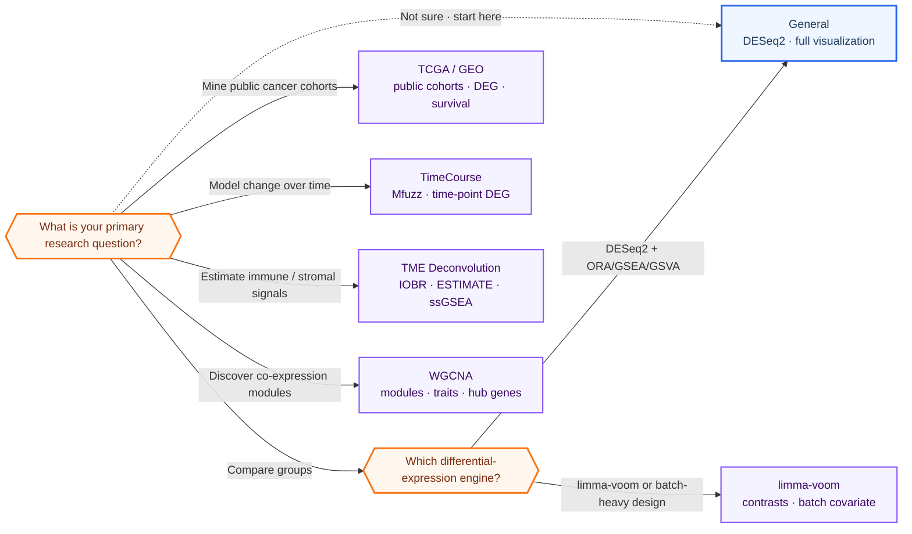

# Template Selection Guide

Not sure which workflow to use? Use the decision table below, then run the corresponding CLI runner for production or its notebook for exploration.

Check the [current freeze audit](FREEZE_AUDIT.md) first: `v0.11.1` fixes WGCNA
hub exports and mouse native CIBERSORT; affected `v0.11.0` results require a
new run. General's paired
switch does not retain an extra batch term, and TimeCourse does not implement
treatment-by-time interactions or a general mixed-effects model. Template
selection does not replace a design review.

## Quick Decision Table

| Your research question | Recommended template | Key features |
|------------------------|----------------------|--------------|
| Two or more groups, simple differential expression | General CLI runner | DESeq2, multi-threshold DEG, ORA/GSEA/GSVA, QC plots |
| Same as above but prefer limma-voom | Limma_Voom CLI runner | edgeR + limma-voom, batch covariate |
| Time-series / drug treatment over time | TimeCourse CLI runner | Mfuzz clustering + time-point vs baseline DEG |
| Tumor microenvironment / immune infiltration | TME CLI runner | IOBR (CIBERSORT/EPIC/xCell/ESTIMATE), ESTIMATE, ssGSEA |
| Co-expression network / module discovery | WGCNA CLI runner | WGCNA soft threshold, module-trait correlation, hub genes |
| TCGA or GEO public data mining | TCGA_GEO CLI runner | TCGA download, GEO download, Tumor vs Normal DEG, survival KM/Cox |

## Detailed Decision Flow



> 💡 **Default starting point:** if none of the branches fits clearly, select General. Use its CLI runner for production; use `RNAseq_General.ipynb` only when interactive exploration is the stated goal.

## Typical Workflow Combinations

1. **General pipeline first, then topic template**
   - Run the General CLI runner to generate `1-DEG/vsd_matrix.csv` and `1-DEG/colData.csv`.
   - WGCNA uses the VST export. TME reuses metadata but computes TPM from the original raw counts plus gene lengths; it never treats VST as TPM.

2. **Time-course from raw counts**
   - Run the General CLI runner once for QC and VST export.
   - Run the TimeCourse CLI runner for Mfuzz clustering and time-point DEG.

3. **Public data mining**
   - Use TCGA_GEO for its lightweight Tumor/Normal or local-file workflow. Route advanced TCGA/TARGET/GTEx, pan-cancer or multi-omics studies through `bulk-rnaseq-analysis` to the separate TCGA toolkit. Inspect GEO preprocessing first: a normalized microarray SeriesMatrix is not input for DESeq2 or limma-voom.

## Notes

- All templates share the same `RNAseq_lib/` helper library. Copy the notebook into your project folder and keep `RNAseq_lib/` accessible (copy it next to the notebook or adjust `LIB_DIR`).
- When in doubt, select General; production runs use its CLI runner and notebooks remain exploratory.

## Non-interactive / batch execution

If you want to run a pipeline without opening a notebook (scheduling, batch
across projects, headless servers), use the command-line runner instead. **Every
template — General plus the five topic templates — ships a
`config.R` + `run_analysis.R` + `visualize_results.R` trio under `templates/`.**

- `templates/General/run_analysis.R` + `config.R` runs the same General pipeline via `Rscript`, with optional switches for TF analysis, TME deconvolution (`RUN_TME`, output to `4-TME/`), Excel export, and the HTML report.
- `templates/Limma_Voom/`, `templates/WGCNA/`, `templates/TME/`, `templates/TimeCourse/`, and `templates/TCGA_GEO/` each provide the equivalent runner for their pipeline (same bootstrap, numbered `0-Config/1-DEG/...` output layout, config snapshot, and summary/sessionInfo tail).
- After a run, each template's `visualize_results.R` regenerates targeted figures (key genes, single-term gseaplot2, ORA theme dot-heatmaps, module/trait plots, KM curves) from the saved results without recompute.

Each `run_analysis.R` takes the config as its first trailing argument
(`Rscript templates/<Topic>/run_analysis.R path/to/config.R`, defaulting to the
template's own `config.R`), so a single template directory serves many projects.
The runner preserves the directory from which it was invoked: relative input
paths and relative `OUTDIR` values are resolved from that run root, while the
config argument is made absolute before loading. For production, create and
enter `analysis/runs/<run_id>/` first, then invoke the central runner with a
project config; the runner never changes into the template source directory.

The notebooks remain the better choice for interactive exploration (tweaking gene
sets for GSVA, ad-hoc plots). See [templates/General/README.md](../templates/General/README.md)
for the canonical walkthrough.

**Converting a notebook to a runner.** `tools/notebook_to_runner.R` extracts a
notebook's `## 1. Parameter Configuration` cell into a `config.R` and flattens
the remaining code cells into a `run_analysis.R` draft, plus a
`conversion_report.txt` flagging patterns that need manual refinement:

```bash
Rscript tools/notebook_to_runner.R notebooks/RNAseq_General.ipynb out_dir --topic General
```
