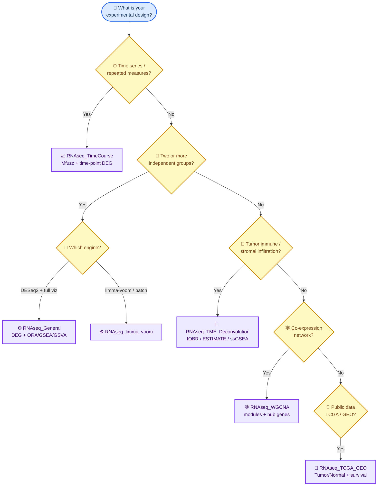

# Template Selection Guide

Not sure which notebook to use? Use the decision table below, then follow the corresponding notebook.

## Quick Decision Table

| Your research question | Recommended template | Key features |
|------------------------|----------------------|--------------|
| Two or more groups, simple differential expression | `RNAseq_General.ipynb` | DESeq2, multi-threshold DEG, ORA/GSEA/GSVA, QC plots |
| Same as above but prefer limma-voom | `RNAseq_limma_voom_Template.ipynb` | edgeR + limma-voom, optional batch correction |
| Time-series / drug treatment over time | `RNAseq_TimeCourse_Template.ipynb` | Mfuzz clustering + time-point vs baseline DEG |
| Tumor microenvironment / immune infiltration | `RNAseq_TME_Deconvolution_Template.ipynb` | IOBR (CIBERSORT/EPIC/xCell/ESTIMATE), ESTIMATE, ssGSEA |
| Co-expression network / module discovery | `RNAseq_WGCNA_Template.ipynb` | WGCNA soft threshold, module-trait correlation, hub genes |
| TCGA or GEO public data mining | `RNAseq_TCGA_GEO_Template.ipynb` | TCGA download, GEO download, Tumor vs Normal DEG, survival KM/Cox |

## Detailed Decision Flow

> 💡 **Default starting point:** if none of the branches fits clearly, run `RNAseq_General.ipynb` first — it covers the most common case and exports the `vsd_matrix.csv` / `colData.csv` that WGCNA and TimeCourse consume.

## Typical Workflow Combinations

1. **General pipeline first, then topic template**
   - Run `RNAseq_General.ipynb` to generate `1-DEG/vsd_matrix.csv` and `1-DEG/colData.csv`.
   - WGCNA uses the VST export. TME reuses metadata but computes TPM from the original raw counts plus gene lengths; it never treats VST as TPM.

2. **Time-course from raw counts**
   - Run `RNAseq_General.ipynb` once for QC and VST export.
   - Run `RNAseq_TimeCourse_Template.ipynb` for Mfuzz clustering and time-point DEG.

3. **Public data mining**
   - Use `RNAseq_TCGA_GEO_Template.ipynb` directly. It can download data or read local files.

## Notes

- All templates share the same `RNAseq_lib/` helper library. Copy the notebook into your project folder and keep `RNAseq_lib/` accessible (copy it next to the notebook or adjust `LIB_DIR`).
- When in doubt, start with `RNAseq_General.ipynb`; it covers the most common use case and exports files that other templates consume.

## Non-interactive / batch execution

If you want to run the General pipeline without opening a notebook (scheduling,
batch across projects, headless servers), use the command-line runner instead:

- `templates/General/run_analysis.R` + `config.R` runs the same General pipeline via `Rscript`, with optional switches for TF analysis, TME deconvolution (`RUN_TME`, output to `4-TME/`), Excel export, and the HTML report.
- After a run, `templates/General/visualize_results.R` regenerates targeted figures (key genes, single-term gseaplot2, ORA theme dot-heatmaps) from the saved results without recompute.

The notebooks remain the better choice for interactive exploration (tweaking gene
sets for GSVA, ad-hoc plots). See [templates/General/README.md](../templates/General/README.md).
